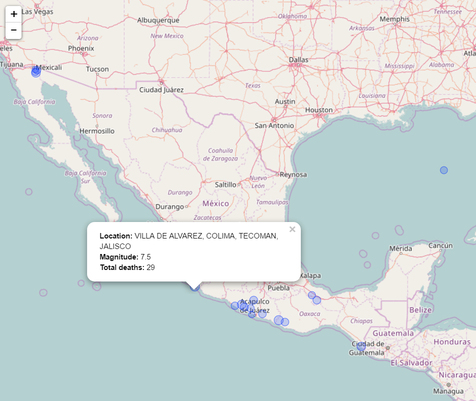

<!-- README.md is generated from README.Rmd. Please edit that file -->

```{r, echo = FALSE}
knitr::opts_chunk$set(
  collapse = TRUE,
  comment = "#>",
  fig.path = "README-"
)
```
# Quake Package

| Current Travis Build Status | [](https://travis-ci.org/RussellPolitzky/quake) |
|-----------------------------|---------------------------------------------------------------------------------------------------------------------------------------|

The `quake` package visualizes [NOAA earthquake data](https://ngdc.noaa.gov/nndc/struts/form?t=101650&s=1&d=1).
`quake` shows when earthquakes happened on a labelled timeline,
and where they happened on an interactive map.

Two custom, `ggplot2` geometries, `geom_timeline` and `geom_timeline_label`
make for easy earthquake, timeline plotting and labelling, while 
function `eq_map` shows earthquake locations.

## Installation

`quake` is available from GitHub and is installed 
using the `devtools` package as follows:

    devtools::install_github("RussellPolitzky/quake")

## Cleaning Data

NOAA data is supplied without a consolidate date column and given locations
includes country, as well as province and city.  As such, the `eq_clean_data`
function adds a `date` column as well as one for `clean_location`.

The example code below reads a sample file using `data.table's` `fread` function
and cleans it using `eq_clean_data`.  The sample shows the first three
rows and columns 1-5, and 48-49 of the cleaned output.

```{r clean_data}
library(data.table)
library(magrittr)
library(quake)

data_file_name <- system.file("extdata", "earthquakes.tsv", package = "quake")
clean_data     <- fread(data_file_name) %>% eq_clean_data
clean_data[1:3, c(1:5, 48:49)] # show 1st three rows and cols 1-5 and 48-49
```

## Plotting an Earthquake Timeline

`quake` has two custom, `ggplot2` geometries to plot earthquake data.
`geom_timeline` plots timelines while `geom_timeline_label` adds 
labels to a timeline.

The example code below generates sample data, and plots 
a timeline showing the dates, magnitudes and countries of the 
quakes.

Generate sample data:

```{r generate_data}
library(magrittr)
library(quake)
library(ggplot2)
library(data.table)

n        <- 100 # no. samples
# get a list of countries and cities.
cty_file <- system.file("extdata", "countries_cities.csv", package = "quake")
ctry_cty <- (fread(cty_file))[sample(1:.N, size = n, replace = TRUE), ]

# Sample data
dt <- data.table(
  date      = as.Date('2017-01-01') + seq(1, 365, 365/n),
  country   = factor(ctry_cty$Country),
  location  = factor(ctry_cty$City   ),
  intensity = runif(n)*10,
  deaths    = runif(n)*12
)
```
Plot the sample data with:

- date on the x axis, 
- country on the y axis, 
- quake magnitude indicated by marker size and, 
- the number of associated deaths indicated by colour

```{r plot_data}
dt %>%
  ggplot() +
  geom_timeline(
    aes(
      x    = date,
      y    = country,
      size = intensity,
      col  = deaths
    ),
    alpha = 0.8
  ) +
  labs(x = "DATE")                                     +
  scale_size_continuous (name = "Richter scale value") +
  scale_color_continuous(name = "# deaths"           ) +
  theme_classic()                                      +
  theme_timeline_with_y_axis_text
```
Notice the `theme_timeline_with_y_axis_text` theme add-on.  This is
one of two themes provided by the `quake` package, the other being
`theme_timeline`, which turns off all y-axis graphics including
text.

Also notice that by adding `y = country`, timelines grouped, 
by country, are produced.  Without this optional aesthetic, all
quakes will be plotted on a single timeline.

## Adding labels to An Earthquake Timeline

The example above shows a timeline without labels.  That is,
the timeline doesn't indicate the actual locations at which
the quakes happened.  The `geom_timeline_label` addresses
this problem.

The example below shows a timeline, plotting the same
data, but with labels added using `geom_timeline_label`.

```{r plot_data_labels}
dt %>%
  ggplot() +
  geom_timeline(       # plot the timeline
    aes(
      x    = date, 
      y    = country, 
      size = intensity, 
      col  = deaths
    ), 
    alpha = 0.8
  ) + 
  geom_timeline_label( # add labels.
    aes(
      label = location , # label text
      x     = date     , # x location
      y     = country  , # level to add label at 
      size  = intensity  #
    ),
    n_max = 5 # only label 5 most intense quakes
  ) +
  labs(x = "DATE")                                     +
  scale_size_continuous (name = "Richter scale value") +
  scale_color_continuous(name = "# deaths"           ) +
  theme_classic()                                      +
  theme_timeline_with_y_axis_text
```

## Mapping Quakes

`quake` also aids visualization by plotting earthquake locations on a map.
The code below:

- reads NOAA data, 
- cleans it,
- filters for quakes that occurred Mexico,
- adds popup text labels using the `eq_create_label` function and
- creates an interactive map with these labels.

```{r mapit, eval = FALSE}
library(quake)
library(readr)
library(dplyr)
library(lubridate)

data_file_name <- system.file("extdata", "earthquakes.tsv.gz", package = "quake")

read_delim(data_file_name, delim = "\t") %>%
  eq_clean_data()                                       %>%
  filter(COUNTRY == "MEXICO" & year(date) >= 2000)      %>%
  mutate(popup_text = eq_create_label(.))               %>%
  eq_map(annot_col = "popup_text")
```
The image below shows sample output.  The sample shows example
pop-up detail displayed when a user clicks on a quake location.


